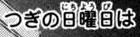
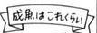
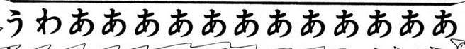
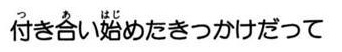
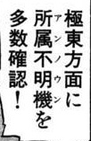
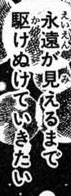
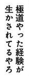
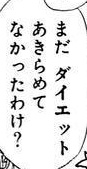

# MangaOCR
#### This project is currently still being improved to resolve outstanding problems.
Optical character recognition for Japanese text, with the main focus being Japanese manga.
It uses a custom end-to-end model built with [PaddePaddle](https://github.com/PaddlePaddle/Paddle) framework and [PaddleOCR](https://github.com/PaddlePaddle/PaddleOCR) library. 

This MangaOCR is inspired by an old project called [manga-ocr](https://github.com/kha-white/manga-ocr) built by [kha-white](https://github.com/kha-white) and other contributors. We admit that although kha-white's manga-ocr model has excellent performance, the size of the model is large (444Mb) and the recognition speed is a bit slow. Thus, this project is built with our goal to provide another end-to-end lightweight model for text recognition in manga. And to achieve performance equivalent to manga-ocr, we also aim to handle a variety of special text types in manga:
- both vertical and horizontal text
- text with furigana
- text overlaid on images
- wide variety of fonts and font styles
- low quality images

# Result

Up until now, our model has achieved the following:
- Small model size with only about 8Mb
- Recognize both vertical and horizontal text
- Recognize text overlapping the image
- Recognize with different fonts and font styles

And things that haven't been achieved yet:
- Better recognition results when compared with manga-ocr. Currently, our model has a CER(Character Error Rate) result of about 14.4% ( 2-10% is good for printed text and 10-20% for handwritten text ).
- Full recognition of unusually long text. With texts of unusually long length (usually over 100 characters), the model is able to predict the first 25-50% of characters, then errors gradually appear.

# Examples

Here are some currently cherry-picked examples showing the capability of the model. 

| image                | Our MangaOCR result |
|----------------------|------------------|
|  | 軍のテストフライトセンター |
|  | つぎの日曜日は |
|  | 成魚」はこれくれい |
|  | うわああああああああああああ |
|  | 付き合い始めたきっかけだって |
|  | 極東方面に所属不明機を多数確認！ |
|  | 永遠が見えるまで駆けぬけていきたい |
|  | 極道やった経験が生かされてるやろ |
|  | まだダイエットあきらめてなかったわけ？ |

# Acknowledgments

This project is currently working with the usage of:
- [Manga109-s](http://www.manga109.org/en/download_s.html) dataset
- [CC-100](https://data.statmt.org/cc-100/) dataset
